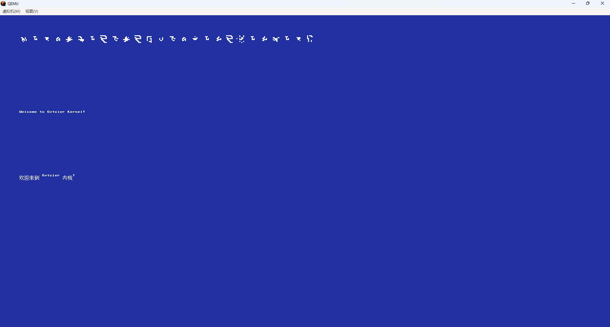
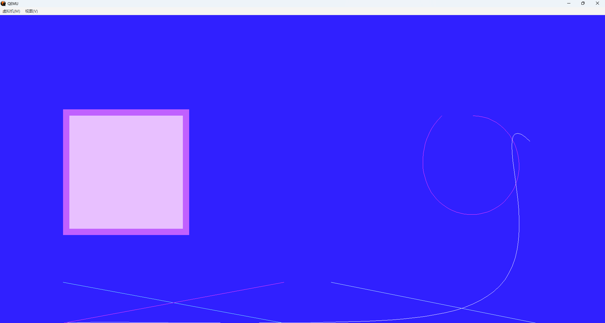

# Gvtcier Kernel


## 简介

Gvtcier 是一个从零编写的操作系统内核，以及围绕它的一组工具：引导层、内核、驱动、自制语言与辅助程序。整个项目不依赖现成内核或交叉编译器，从实模式引导汇编开始逐步构建，直至可运行的多子系统内核。

内核与驱动使用 Rust 编写，驱动作为独立的用户态程序运行，通过消息与内核通信。目标平台为 x86-64，引导支持 BIOS 与 UEFI 两种方式，输出两个独立镜像：`Gvtcier_x86_64.iso`（UEFI 默认）与 `Gvtcier_x86_32.iso`（BIOS 兼容默认）。

内核自带图形库、音频解码、网络协议栈与命令行 Shell，并配套 GvtcierC 编程语言、Gvt 版本控制工具与最小虚拟机，构成一套可独立运转的系统生态。



## 组成结构

```
Gvtcier\
├── BIOS\            BIOS 引导（boot.asm + stage2.asm）
├── Demo\            演示程序（draw：图形/字符演示）
├── Gvt\             版本控制工具
├── GvtcierC\         GvtcierC 语言
├── GvtcierXuNiJi\    虚拟机（AHCI/网络仿真）
├── Kernel\
│   ├── abi\          对外接口
│   ├── bootloader\   引导程序
│   ├── kernel\       内核
│   └── Drive\        内置驱动
├── docs\             文档
└── iso\              ISO 打包工具
```

| 组成 | 说明 |
|------|------|
| BIOS 引导 | 实模式引导扇区，读取 FAT12 定位内核，经 32 位保护模式兼容层（pm32）加载 gcx 段、建页表，最终进入 64 位长模式 |
| UEFI 引导 | bootloader.efi，由 UEFI 固件直接加载内核 gcx |
| 内核 | 内存、任务、进程、消息、权能、文件、网络、图形、音频等子系统，完整实现见 docs |
| 内置驱动 | GvFAT、FAT、键盘、鼠标，作为独立用户态驱动经消息与内核通信 |
| GvtcierC | 自制编程语言，含独立编译链 gvtcierc（前端）与 gvtcierk（汇编器+链接器），可直接生成 Windows PE 可执行文件 |
| Gvt | 版本控制工具，提供初始化、添加、提交与历史命令 |
| GvtcierXuNiJi | 最小虚拟机，AHCI/网络仿真 |
| iso 工具 | gvtcier-gcx（ELF→gcx）、gvtcier-iso（打包双镜像）、gvtcier-mkdisk（生成磁盘） |

## 功能特性

- 内存管理：4 级页表（PML4/PDPT/PD/PT）映射与撤销、Buddy 分配器（阶数按内存总量自动推导，selftest 自检）、堆分配器（相邻空闲块前后向合并、分配/失败/空闲字节统计、容量按内存 1/4 自动推导）、虚拟内存映射（TLB 刷新 invlpg、地址对齐校验、页表遍历深度上限、map_aligned/unmap_aligned）、写时复制 CoW（共享零页栈映射，首次写入触发复制）、内核虚拟基址随机化 KASLR（RTC/tick 种子，页对齐偏移）、用户栈守护页（栈底一页不映射，向下溢出触发异常）
- 任务调度：多任务（MAX_TASKS=8）、时间片轮转（APIC 定时器 100 tick）、阻塞唤醒（block_on/wake_on）、上下文切换（汇编保存/恢复寄存器）、软件定时器（timer_set/cancel/poll，基于 tick 定时唤醒）、动态优先级（set_priority，运行降级/阻塞提升防饥饿）、性能采样（perf_sample/report，按任务统计 CPU 占用）
- 进程：裂变模型 fission（MAX_PROCESSES=64、父进程记录、运行 tick 统计、pid 复用）、信号机制（SIG_TERM 终止信号，signal_send/poll）、内核线程（kthread_create，独立内核态执行单元）
- 同步：信号量（sem_create/wait/post/destroy）、条件变量（cv_create/wait/notify/destroy）
- 消息与权能：进程间端点消息（消息 32B、队列 64 槽、端点 16 个、环形队列占用统计、端点销毁、中断保存/恢复保护）、权能控制（MAX_CAPS=32、RIGHT_SEND/RIGHT_RECV 权限位、回收/按对象查找/权限校验）
- 系统调用：1-40 号，覆盖文件、图形、内存、进程、驱动、时间等；系统调用审计（按号计数，syscall_count/total 查询）
- 文件系统：GvFAT（多级目录树、路径解析 a/b/c、文件名 12B、目录项 40B 含 8 字节块号与大小、秒级时间戳、目录/只读/隐藏属性、用户/组权限（chown/写权限校验）、符号链接（gvfat_ln、4 跳解析防环）、硬链接（gvfat_link，共享数据块）、文件锁（gvfat_lock/unlock，读写互斥）、目录变更事件（event_log 环形日志 + 查询）、fsck 位图一致性校验、坏块标记、目录块缓存、写入 +8 块预分配、批量读取 ≤8 块/syscall、追加写、截断、状态查询、多盘挂载）
- 存储：AHCI 磁盘驱动（48 位 LBA、FIS 6 字节、128PB 寻址上限）、ATA PIO 兼容路径、位图分配（每块 1 位、4096 块/扇区）
- 网络：Gvinter 驱动，以太网帧 + ARP（缓存表 8 条）+ IPv4/IPv6（NDP：NS/NA 邻居发现、RA 网关学习）+ TCP（连接表 8 路复用、拥塞控制：慢启动/拥塞避免/超时重传、FIN 状态机）+ UDP（通用收发接口）+ DHCP 客户端（DISCOVER/OFFER/REQUEST/ACK，动态获取 IP）+ DNS + HTTP（客户端 + 服务器）+ 原始套接字（raw_open/send/recv，帧级收发，最大帧 1500B，IPv4 头校验和验证）
- 图形：Gvtcier2D 绘制原语（画布 16 个、参数校验、裁剪合成、贝塞尔曲线 64 段、直线/矩形/圆形/文本）、GvFont 点阵皮肤（10×10 点阵、52 字母、.gvf 格式、按 Gv-2280 码点渲染）
- 编码：Gv-2280 默认输出（单字节 0x20-0x53 字母区、双字节 0x80 xx 汉字区），GB2312 兼容（6763 汉字表、16×16 点阵字库）
- 音频：Ogg / MP3 / FLAC 解码播放（PCM 输出、44100Hz/16bit）、AC97 声卡驱动（采样率寄存器、主音量配置、play_pcm DMA 播放）
- 中断：APIC/IOAPIC（LAPIC 0xFEE00000、IOAPIC 0xFEC00000）、IDT 中断门、GDT 代码/数据/64 位段、键盘 PS/2、鼠标 PS/2
- 驱动：PCI 枚举（多函数 0-7、IRQ 读取、BAR 读取）、热插拔检测（poll 轮询对比设备表，报告新增/移除）、驱动注册/注销/按能力查找（CAP_FAT/CAP_GPU/CAP_AUDIO）、键盘、鼠标、串口（COM1/COM2、Gv-2280 输出）
- 多核：SMP 启动（trampoline 0x8000、INIT-SIPI 启动 AP、MAX_APS=8、独立 AP 栈）、AP 参与调度循环、每核 APIC 定时器（init_timer/wait_tick）、AP 状态记录（AP_ALIVE、cpu_count/ap_alive_count 查询）
- 安全：崩溃转储（panic 输出 15 通用寄存器 + cr2 快照）、SMEP 保护（CPUID 检测，CPU 支持时启用 CR4.SMEP 防内核执行用户代码）
- 时间：RTC 日期时钟（年/月/日/星期/时/分/秒 BCD 解码）、运行 tick 计数（time 命令）
- GvShell：内置命令行（help/ls/cd/cat/mkdir/rm/ping/http/dns/info/tasks/kill 等）

## 能力与限制

| 项目 | 程度 |
|------|------|
| 架构 | x86-64 内核；BIOS（x86_32 兼容引导）与 UEFI 双引导 |
| 磁盘容量 | 48 位 LBA，上限 128PB；BIOS 500GB / UEFI 1TB 已验证 |
| 文件系统 | GvFAT：多级目录、秒级时间戳、fsck 校验、多盘挂载、追加/截断/状态查询 |
| 网络 | 以太网 + ARP（缓存）+ IPv4/IPv6（NDP）+ TCP（连接表多路复用、拥塞控制）+ UDP（通用收发）+ DHCP + DNS + HTTP（客户端 + 服务器）+ 原始套接字 |
| 音频 | Ogg/MP3/FLAC 解码播放（PCM 输出）+ AC97 声卡驱动 |
| 多核 | SMP：AP trampoline（0x8000）+ INIT-SIPI 启动，MAX_APS=8，独立 AP 栈；AP 参与调度循环；每核 APIC 定时器；cpu_count/ap_alive_count 可查询 |
| 图形 | Gvtcier2D 绘制、GvFont 点阵皮肤、Gv-2280/GB2312 编码 |
| 验证环境 | QEMU：UEFI 模式与 BIOS 模式均可引导并进入内核；GvtcierXuNiJi：AHCI 布局与网络帧仿真验证 |
| 加固 | 页表地址对齐校验与深度上限、OOM 错误返回（替代 panic）、Shell dump 内存范围校验、系统调用指针/长度/阶数校验、TCP 段头长度越界防御、SMEP 保护（CPUID 检测）、崩溃转储 |
| 未支持 | ARM、RISC-V 为规划中；产物命名规范见 docs/BUILD.md |

## 演示

启动后显示三行字符演示：Gv 字体皮肤、英文与中文，用于展示 Gvtcier2D 与 GvFont 的渲染能力。



## 文档

- docs/ABI.md：接口约定
- docs/API.md：系统调用封装
- docs/BUILD.md：编译流程
- docs/FISSION.md：裂变模型
- docs/GCX.md：gcx 内核格式
- docs/GUIDE.md：新手指南
- docs/Gv2280.md：Gv-2280 编码
- docs/GvDebug.md：GvDebug 仿真调试
- docs/GvFAT.md：GvFAT 文件系统
- docs/Gvinter.md：Gvinter 网络驱动
- docs/GVPIR.md：GVPIR 专有接口参考
- docs/Gvt.md：Gvt 版本控制
- docs/Gvtcier2D.md：图形库使用
- docs/GvtcierC.md：GvtcierC 关键字与编译器命令

## 许可证

MIT License，Copyright (c) 2026 Gvtcier Team
